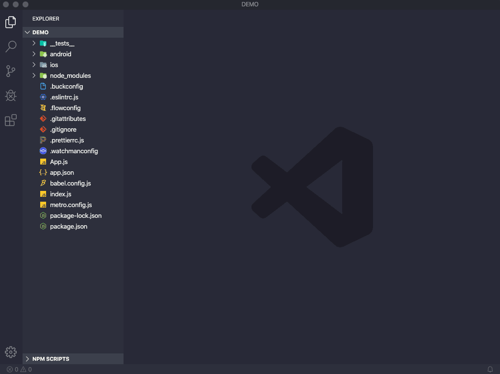

# react-native-boilerplate

Best way to structure any react-native application.



## How-To ?

1.  Just Press (command/ctrl+Shift+p).
2.  Type "generate boilerplate".
3.  A select your desire boilerplate.

## Structure Your project within seconds

### 1. Basic BoilerPlate

It will generate basic structure for your react-native project as following.

```
-app
	-res
		-fonts (put all your fonts files in this folder)
		-images (put all your images in this folder)
		-fonts.js
		-images.js
		-colors.js
		-dimensions.js
	-src
		-scenes (put all your screen in this folder)
		-components (put all your components in this folder)
		-R.js
		-Routes.js (put your navigation here)

```

### 2. Component Index

This file will generate index.js file in component folder, so it will be easy to access all your component in screens. Just import them from ./components

### 3. Scenes Index

This file will generate index.js file in scenes folder, so it will be easy to access all your screens in navigation. just import them from ./scenes

### 4. Images

This will populate your images.js file in res folder

### 5. Fonts

This will populate your fonts.js file in res folder

### 6. Redux Boilerplate

It will generate structure for your react-native project with redux as following.

```
-app
	-src
	-redux
		-actions
			-actiontypes.js
			-(put your all action here)
		-reducers
			-rootreducer.js (combine reducer)
			-(put your all reducers here)
		-store.js
		-middleware.js

```

### 7. ContextAPI/Hooks Boilerplate

In Future!

## To-Do

- [ ] Add boilerplate for ContextAPI/Hooks

- [ ] Add more project structures

## Known Issues

None.
If you find something, please report it by opening [new issue](https://github.com/rishikeshgaikar/vscode-react-native-boilerplate/issues).

## Acknowledgements

This extension was inspired by:

- [How to structure your project and manage static resources in React Native](https://www.freecodecamp.org/news/how-to-structure-your-project-and-manage-static-resources-in-react-native-6f4cfc947d92/)

## Credits

Logo icon is React icon by [Icons8](https://icons8.com)
